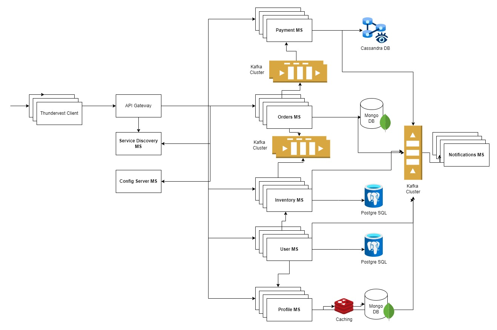

# Thundervest

SaaS platform for startups and MSMEs to effortlessly raise capital while offering investors a secure and transparent environment to discover and invest in promising opportunities.

This repository contains all the documents related to the project right from requirement analysis documents and architecture documents and diagrams.

### Architecture Diagram :
Below is the high level architecture diagram for Thundervest. The application will be completely built using Microservices architecture for a highly robust, secure and scalable system.

### Tech Stack :

`Backend` - Java 21, Spring Boot 3, Spring Security 6, Spring Cloud

`Frontend` - HTML, Tailwind CSS, JavaScript, ReactJS, React Icons

`Tools` - Figma, Draw.io, Youtrack, Maven, IDEA Ultimate

`Pipeline & Infrastructure` - Kafka, Redis, MongoDB, PostgreSQL, Jenkins, SonarQube, Tomcat, Docker, Kubernetes, AWS EC2

### Frontend Source Code Repositories :

**Client Application** : https://github.com/sanketvy/Thundervest-Client
### Microservices Source Codes Repositories :
**User MS** : https://github.com/sanketvy/Thundervest-User-MS

**Profile MS** : https://github.com/sanketvy/Thundervest-Profile-MS

**Payment MS** : https://github.com/sanketvy/Thundervest-Payment-MS

**Orders MS** : https://github.com/sanketvy/Thundervest-Orders-MS

**Notification MS** : https://github.com/sanketvy/Thundervest-Notification-MS

**Inventory MS** : https://github.com/sanketvy/Thundervest-Inventory-MS

**Discovery Server MS** : https://github.com/sanketvy/Thundervest-Discovery-MS

**Config Server MS** : https://github.com/sanketvy/Thundervest-Config-MS

**API Gateway MS** : https://github.com/sanketvy/Thundervest-APIGW-MS

### Contact

If you are intrested in the project and want to know more about the project, want to contribute to the project or hire me as a software developer, drop a mail at srvyawahare18@gmail.com
